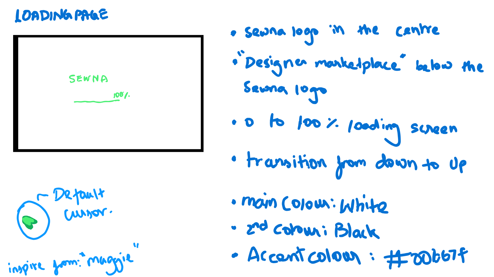
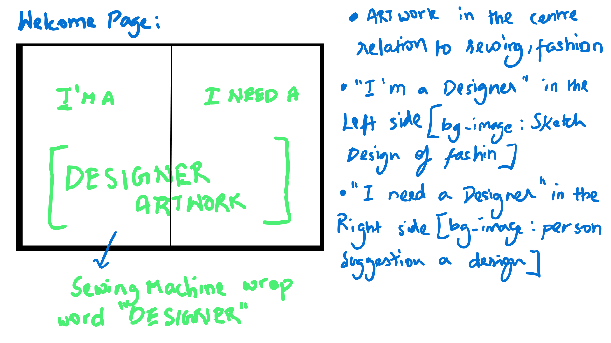
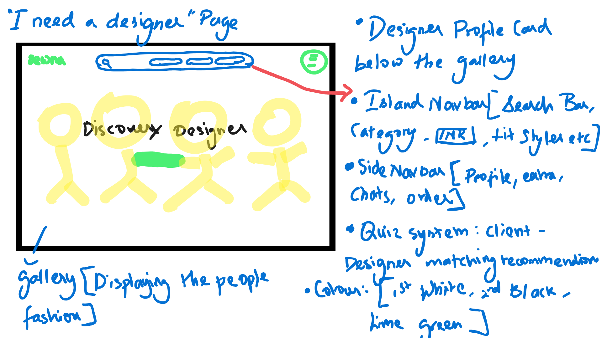

## SEWNA ASSIGNMENT

##  Core Features

###  Navigation & Structure
- **Glassmorphic Island Navbar** with search, category filters, and sorting options  
- **Sidebar Navigation:** Profile, Explore, Chats, Orders, Custom Requests, Favourites  
- **Responsive Layout:** Works seamlessly across desktop, tablet, and mobile  

###  Designer Discovery
- Browse and explore verified fashion or creative designers  
- **Designer Cards:** Profiles with tags, hover animations, and quick-view  
- **Filtering & Sorting:** Discover designers by style, budget, or rating  
- **Featured Section:** Highlight trending or top-rated creators  

###  Designer Quiz Modal
- Interactive multi-step quiz to match clients with suitable designers  
- Engaging UI with blurred modal background  
- Personalized recommendations based on project needs  
- Smooth transitions and progress tracking  

###  Landing Page
- Split-zone layout for “I’m a Designer” and “I Need a Designer”  
- Center **typographic illustration** — “DESIGNER”  
- Elegant hover animations and transitions  
- Fully responsive and performance-optimized  

###  User Experience Highlights
- Smooth page transitions and animations  
- Subtle hover and glow effects using lime green accents  
- Loading progress screen  
- Accessibility-conscious design choices  

---

## Technology Stack

### Frontend
- **React** — Component-based UI framework  
- **TypeScript** — Type-safe and scalable development  
- **Vite** — Lightning-fast development environment  
- **Tailwind CSS** — Utility-first styling framework  
- **Shadcn/UI** — Elegant prebuilt UI components  
- **Framer Motion** — Interactive and smooth animations  
- **React Router** — Client-side navigation  
- **React Hook Form** + **Zod** — Form control and validation  

### Development Tools
- **ESLint** — Code linting and error detection  
- **Prettier** — Code formatting consistency  
- **Husky** & **Commitlint** — Git workflow enforcement  

---
## Installation

1. **Clone the repository**
   ```bash
   git clone https://github.com/Jeevakrishna/Sewna.git
   cd Sewna
   ```

2. **Install dependencies**
   ```bash
   npm install
   # or
   yarn install
   # or
   pnpm install
   ```

3. **Start the development server**
   ```bash
   npm run dev
   # or
   yarn dev
   # or
   pnpm dev
   ```

4. **Build for production**
   ```bash
   npm run build
   # or
   yarn build
   # or
   pnpm build
   ```


##  Design Guidelines
| Element | Style |
|----------|--------|
| **Primary Color** | White (#FFFFFF) |
| **Secondary Color** | Black (#000000) |
| **Accent Color** | Lime Green (#00b67f) |
| **Font Weight** | Bold / Black |
| **Visual Tone** | Soft, confident, and modern |
| **Typography** | Tight letter spacing, clean lines, expressive layout |

### Design Previews

<p align="left">
  
  <br/>
  <em>Figure 1: Landing Page - Cursor Design </em>
</p>

<p align="left">
  
  <br/>
  <em>Figure 2: Split Zone Layout </em>
</p>

<p align="left">
  
  <br/>
  <em>Figure 3: Designer Discovery - Interactive Quiz Flow</em>
</p>

The application uses a consistent design system with:
- Custom color palette
- Responsive typography
- Reusable UI components
- Smooth animations and transitions

## Development Workflow

### Branching Strategy
- `main` - Production-ready code
- `develop` - Development integration branch
- `feature/*` - New features
- `bugfix/*` - Bug fixes
- `hotfix/*` - Critical production fixes

##  Scrum Agile Model

###  Sprint Duration: 2 Days

#### **Sprint Backlog**
| Day | Task | Description |
|-----|------|-------------|
| **Day 1** | Research, Design & Setup | Understand user flow, reimagine SEWNA’s welcome screen, finalize typography and layout. Set up project environment using React + Tailwind CSS. |
| **Day 2** | Implementation & Testing | Build the responsive welcome page with hover animations and the Designer Discovery feature (gallery, navbar, quiz modal). Conduct quick reviews and polish UI interactions. |

#### **Sprint Outcome**
- Functional **Welcome Page** with split layout and center illustration.  
- **Designer Discovery Page** with gallery, glassmorphic navbar, and interactive quiz.  
- Fully responsive design aligned with SEWNA’s brand tone — clean, confident, and minimal.  

#### **Team Roles**
| Role | Assigned To |
|------|--------------|
| **Product Owner** | Jeevakrishna |
| **Scrum Master** | Self-managed |
| **Developer / Designer** | Jeevakrishna |

## Future Improvements 
- Profile upload and portfolio showcase  
- Chat and collaboration integration  
- Payment flow for designer-client projects  

---

## Visual Identity
Minimal line-art aesthetic inspired by **modern creative studios**.  
Typography-based design emphasizing **personality, confidence, and simplicity**.  
Hints of **lime green (#00b67f)** for brand distinctiveness.

---

## Learnings
- Translating brand emotion into interactive design  
- Balancing minimalism with expressiveness  
- Applying Agile methodology to design-driven development  
- Using modern React and Tailwind features for scalable UI design
- 
## Project Structure

```
src/
├── assets/            # Static assets (images, fonts, etc.)
├── components/        # Reusable UI components
│   ├── common/       # Shared components
│   ├── landing/      # Landing page components
│   ├── quiz/         # Quiz flow components
│   └── ui/           # Base UI components
├── data/             # Static data and mock data
├── hooks/            # Custom React hooks
├── lib/              # Utility functions and configurations
├── pages/            # Page components
├── styles/           # Global styles and themes
└── types/            # TypeScript type definitions
```

## Acknowledgments

- [Shadcn/UI](https://ui.shadcn.com/) for the beautiful component library
- [Tailwind CSS](https://tailwindcss.com/) for the utility-first CSS framework
- [Vite](https://vitejs.dev/) for the amazing development experience
- [React](https://reactjs.org/) for the awesome UI library


## Learnings
- Translating brand emotion into interactive design  
- Balancing minimalism with expressiveness  
- Applying Agile methodology to design-driven development  
- Using modern React and Tailwind features for scalable UI design  

---

##  Author
** Jeevakrishna Vetrivel**  
Developer & Designer  
Passionate about product design, creative coding, and interactive UI.  
[Portfolio](https://jeevakrishna-portfolio.vercel.app/) | [LinkedIn](https://linkedin.com/in/jeevakrishna73)


